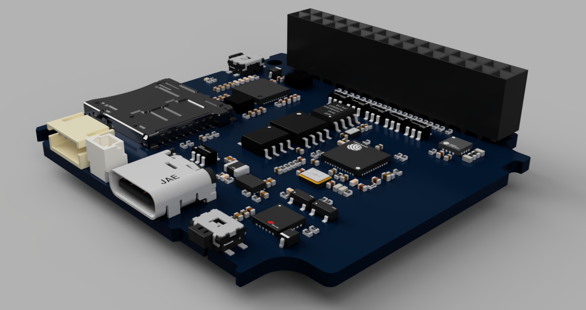
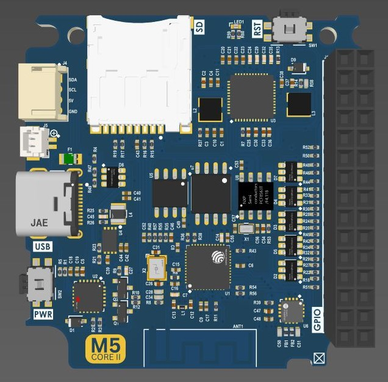
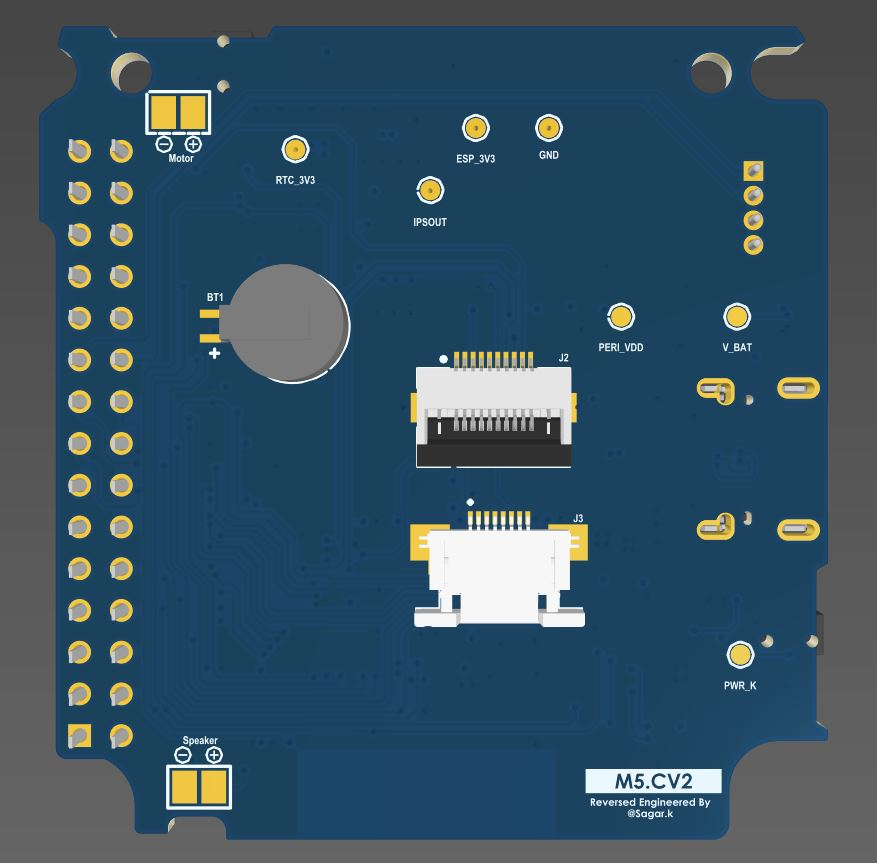
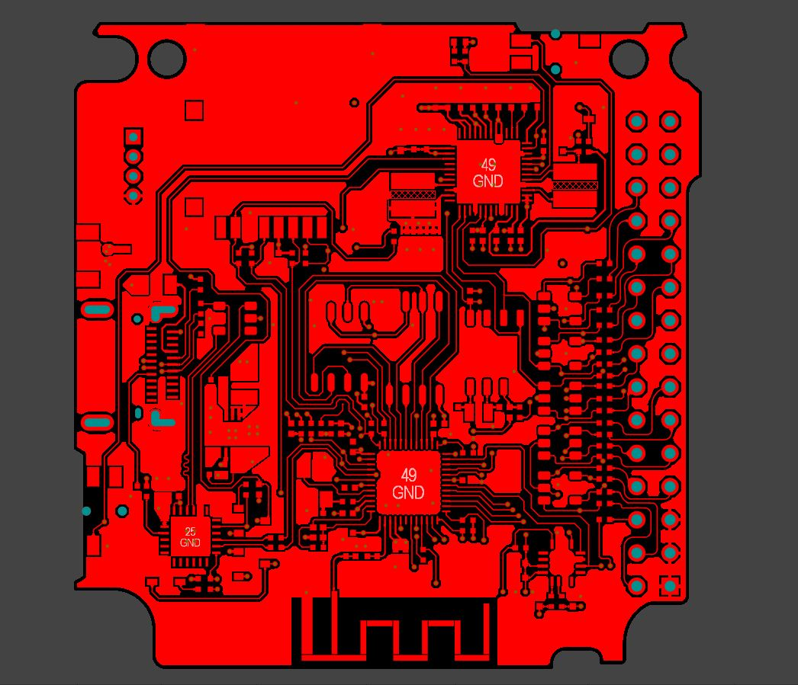
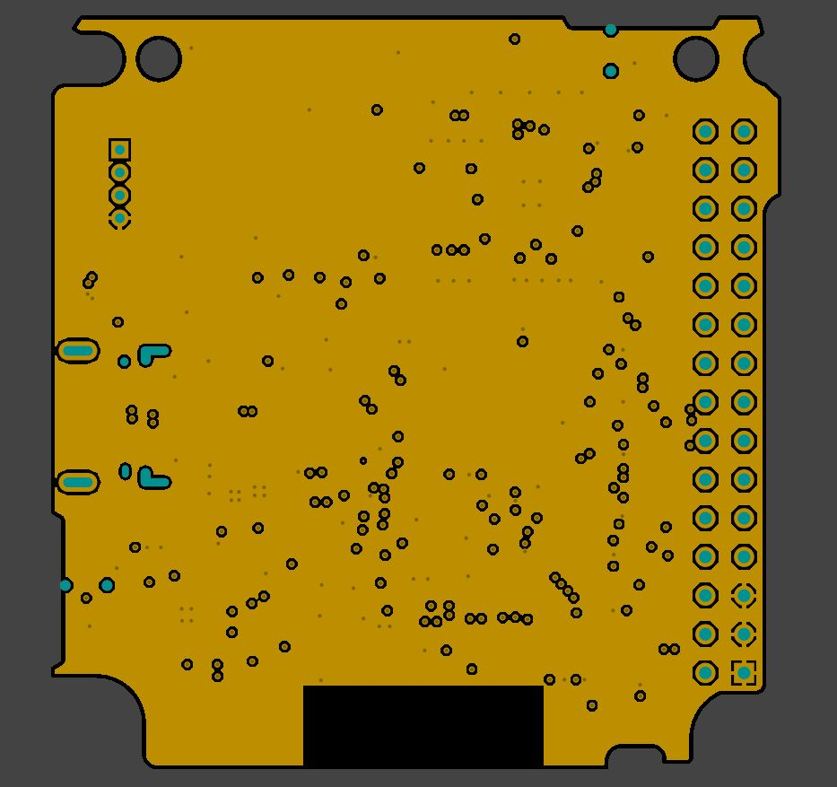
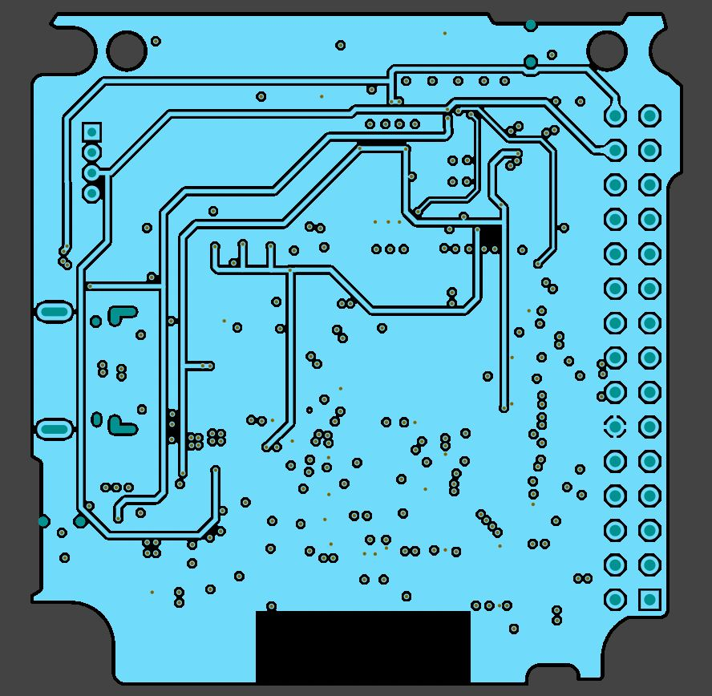
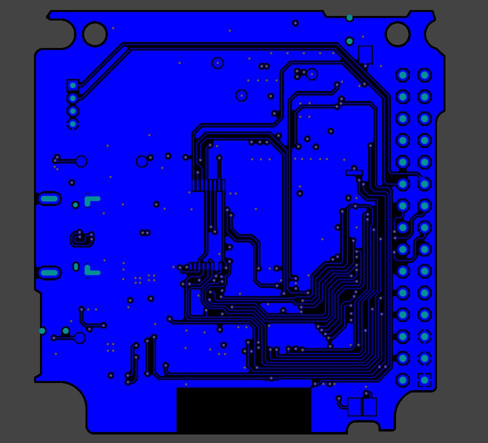

# M5Stack CORE2 PCB Reverse Engineering Project
This repository contains a reverse-engineered PCB design of the M5Stack CORE2 development board created in Altium Designer.

## Board Preview

<!-- 

  
  

 -->

<table>
  <tr>
    <td align="center">
       
      Top Side
    </td>
    <td align="center">
       
      Bottom Side
    </td>
  </tr>
</table>

## Repository Contents
- `M5_CORE2.PrjPcb` - Main Altium Designer project file
- `M5_CORE2_re.SchDoc` - Schematic document
- `M5_CORE2_re.PcbDoc` - PCB layout document
- `myLibs.SchLib` - Schematic library
- `myLibs.PcbLib` - PCB footprint library
- `/Documentation` - Images and Schematic files

## Documentation

### PCB Specifications
- Layer count: 4 layers
- Board dimensions: 48 x 49.5 mm
- No. of components: 165

### Layer Stack-up
1. Top Layer - Signal
2. Inner Layer 1 - Ground
3. Inner Layer 2 - Power
4. Bottom Layer - Signal

### Schematic
The complete schematic is available in PDF format here: [`Schematic PDF`](Documentation/M5_CORE2_Schematic.pdf)

## PCB Layout
<table>
  <tr>
    <td align="center">
       
      Top Layer
    </td>
    <td align="center">
       
      Inner Layer 1 - Ground
    </td>
  </tr>
  <tr>
    <td align="center">
       
      Inner Layer 2 - Power
    </td>
    <td align="center">
       
      Bottom Layer
    </td>
  </tr>
</table>

## How to Use
1. Clone this repository, or [Download](https://github.com/sagar-koirala/M5Stack-CORE2-PCB-RE/archive/refs/heads/main.zip) as Zip.
2. Open the project in Altium Designer
3. All required libraries are included in the project. Generate outputs as needed

## Disclaimer
This is an unofficial reverse-engineered design for educational purposes. This project is not affiliated with or endorsed by M5Stack.